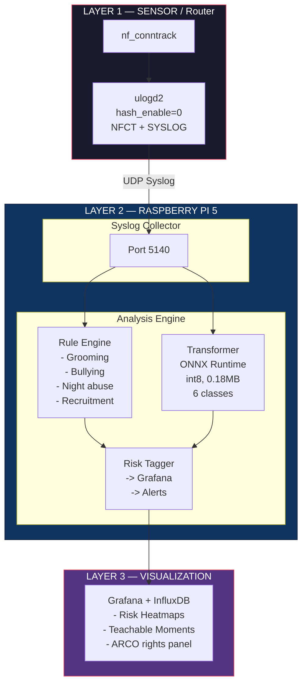
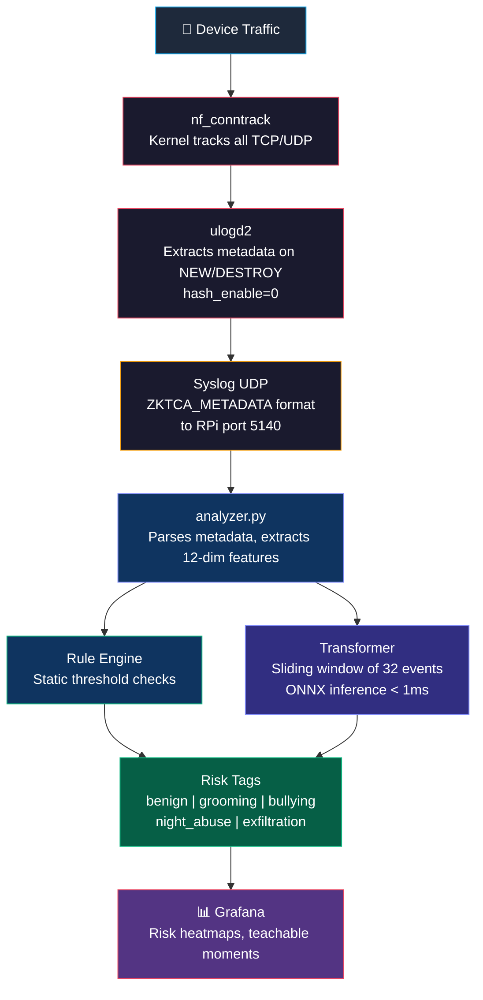
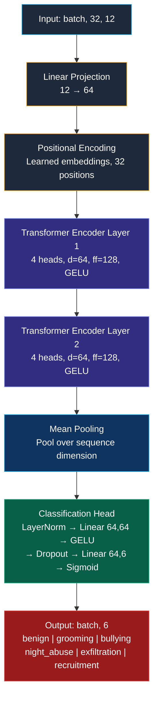

# 🏗️ Architecture & Setup Guide

Detailed architecture, data flow, deployment, and execution instructions for the ZKTCA Child Protection System.

---

## Table of Contents

1. [System Architecture](#system-architecture)
2. [Data Flow Pipeline](#data-flow-pipeline)
3. [Component Details](#component-details)
4. [Scientific Foundations](#scientific-foundations)
5. [How Transformers Work](#how-transformers-work)
6. [Transformer Model Architecture](#transformer-model-architecture)
7. [How to Run](#how-to-run)
8. [Deployment to Raspberry Pi](#deployment-to-raspberry-pi)
9. [Grafana Dashboard Setup](#grafana-dashboard-setup)
10. [Legal Compliance Module](#legal-compliance-module)

---

## System Architecture

The system follows a **Sensor → Collector → Analyzer → Dashboard** pipeline with strict separation of concerns:



### Hardware Requirements

| Component | Specification | Purpose |
|---|---|---|
| Router | MediaTek MT7986A, 1GB RAM, OpenWrt 23.05+ | Network metadata extraction |
| Raspberry Pi | RPi 5, 8GB RAM, NVMe SSD 256GB | ML inference + data storage |
| Network | Gigabit Ethernet with VLAN support | Isolate children's traffic |

---

## Data Flow Pipeline



### Metadata Format (ZKTCA)

Each log line from the router follows this format:

```
ZKTCA_METADATA: src_ip=192.168.1.10 dst_ip=8.8.8.8 src_port=12345 dst_port=443 protocol=6 packets=15 bytes=25000 event=NEW
```

**What is captured** (metadata only):
- Source and destination IP addresses
- Source and destination ports
- Protocol number (6=TCP, 17=UDP)
- Packet count and byte count
- Connection event type (NEW / DESTROY)

**What is NOT captured** (privacy by design):
- ❌ No packet content / payload
- ❌ No URLs or domain names
- ❌ No SNI (Server Name Indication)
- ❌ No DNS queries
- ❌ No TLS decryption

---

## Component Details

### 1. Router Sensor (`ulogd.conf`)

The router runs OpenWrt with `ulogd2` configured to export connection tracking events:

```ini
[ct1]
hash_enable=0    # Critical: emit NEW and DESTROY separately

[syslog1]
facility=16      # local0
level=6          # informational
format="ZKTCA_METADATA: src_ip=%(src_ip)s dst_ip=%(dst_ip)s ..."
```

**Key setting:** `hash_enable=0` ensures each connection lifecycle (start → end) is logged as two separate events, allowing the analyzer to compute exact connection durations and Inter-Arrival Times (IAT).

### 2. Analysis Engine (`analyzer.py`)

The analyzer supports three operating modes:

| Mode | Flag | Description |
|---|---|---|
| **Rules** | `--mode rules` | Static thresholds only (lightweight, no ML) |
| **Transformer** | `--mode transformer` | ML-only classification via ONNX |
| **Hybrid** | `--mode hybrid` | Both engines in parallel (default) |

### 3. Grafana Dashboard (`grafana_dashboard.json`)

Privacy-preserving panels:
- **Risk Heatmap** — Geographic map of connections highlighting risky jurisdictions
- **Teachable Moments** — Alert table for parent-child dialogue opportunities
- **Night Activity** — Stat panel showing off-hours connection minutes

---

## Scientific Foundations

Each risk category in the ZKTCA system is grounded in published research on child online safety, behavioral psychology, and network security. This section explains **why** each pattern constitutes a risk and **how** it manifests in network metadata — without ever inspecting content.

### 1. Online Grooming — Platform Migration Pattern

#### Why is it a risk?

Online grooming follows a well-documented behavioral model where a predator progressively manipulates a child through several stages. Research by **Kloess et al. (2014)** and the **O'Connell model (2003)** describe these stages as:

1. **Friendship forming** — Initial contact on a public platform (gaming, social media)
2. **Relationship forming** — Building trust and emotional dependency
3. **Risk assessment** — Testing whether the child will keep secrets
4. **Exclusivity** — Isolating the child from peers and parents
5. **Sexual stage** — Introducing explicit content or requests

A critical observable behavior is **"platform migration"** or **"off-platforming"** (WeProtect Global Alliance, 2023): predators initiate contact on mainstream, moderated platforms (like Minecraft or Roblox) and then rapidly move the conversation to private, encrypted channels (Discord DMs, Telegram, WhatsApp) to evade parental controls and platform moderation.

#### How we detect it through metadata

We do **not** read messages. Instead, we observe the **port category transition pattern** in the network flow:

| Time | Destination Port | Category | What the model sees |
|---|---|---|---|
| 16:00 – 16:27 | 19132 (Minecraft) | Gaming (UDP) | Stable gaming pattern |
| 16:28 – 16:30 | 443 (Discord) | Chat (TCP) | **Abrupt category shift** |
| 16:30 – 17:00 | 443 (Telegram) | Chat (TCP) | Sustained encrypted chat |

The Transformer detects that the **temporal sequence** — sustained gaming followed by rapid migration to encrypted chat — matches grooming-stage-4 isolation behavior.

#### References

- O'Connell, R. (2003). *A Typology of Child Cybersexploitation and Online Grooming Practices*. University of Central Lancashire.
- Kloess, J. A., Beech, A. R., & Harkins, L. (2014). Online child sexual exploitation: Prevalence, process, and offender characteristics. *Trauma, Violence, & Abuse*, 15(2), 126–139. [DOI: 10.1177/1524838013511543](https://doi.org/10.1177/1524838013511543)
- Whittle, H. C., Hamilton-Giachritsis, C., Beech, A. R., & Collings, G. (2013). A review of online grooming: Characteristics and concerns. *Aggression and Violent Behavior*, 18(1), 62–70. [DOI: 10.1016/j.avb.2012.09.003](https://doi.org/10.1016/j.avb.2012.09.003)
- WeProtect Global Alliance. (2023). *Global Threat Assessment 2023*. [weprotect.org](https://www.weprotect.org/global-threat-assessment/)

---

### 2. Cyberbullying — Coordinated Inbound Burst Pattern

#### Why is it a risk?

Cyberbullying differs from traditional bullying in its scale and persistence. Research by **Kowalski et al. (2014)** and **Hinduja & Patchin (2015)** identifies key characteristics of online harassment:

- **Asymmetry** — Multiple aggressors target a single victim
- **Intensity** — Concentrated bursts of messages/media in short windows
- **Anonymity** — Aggressors use multiple accounts or IPs
- **Persistence** — Digital content remains accessible after the attack

A coordinated cyberbullying attack (sometimes called a "raid" or "pile-on") produces a distinctive network signature: a **single target IP receiving inbound connections from many unique source IPs within a short time window**, with highly asymmetric traffic (much more data received than sent).

#### How we detect it through metadata

| Metric | Normal browsing | Bullying attack |
|---|---|---|
| Unique source IPs (5 min) | 2-5 | **10-30** |
| Bytes ratio (up/down) | 0.3-0.7 | **< 0.2** (download-heavy) |
| Inter-arrival time | 0.5-10s | **< 0.5s** (rapid burst) |
| Destination entropy | 0.3-0.6 | **> 0.8** (high diversity) |

The model correlates the simultaneous spike in unique sources, asymmetric bytes ratio, and rapid IAT as a bullying pattern.

#### References

- Kowalski, R. M., Giumetti, G. W., Schroeder, A. N., & Lattanner, M. R. (2014). Bullying in the Digital Age: A Critical Review and Meta-Analysis. *Psychological Bulletin*, 140(4), 1073–1137. [DOI: 10.1037/a0035618](https://doi.org/10.1037/a0035618)
- Hinduja, S., & Patchin, J. W. (2015). *Bullying Beyond the Schoolyard: Preventing and Responding to Cyberbullying* (2nd ed.). Corwin Press.
- Zych, I., Ortega-Ruiz, R., & Del Rey, R. (2015). Systematic review of theoretical studies on bullying and cyberbullying. *Aggression and Violent Behavior*, 23, 1–21. [DOI: 10.1016/j.avb.2015.03.007](https://doi.org/10.1016/j.avb.2015.03.007)

---

### 3. Nocturnal Abuse — Persistent Late-Night Usage Pattern

#### Why is it a risk?

Research consistently links **excessive nocturnal screen time in children and adolescents** with multiple harms:

- **Sleep disruption**: Hale & Guan (2015) found that screen-based media use was significantly associated with delayed sleep onset, reduced sleep duration, and increased sleep deficiency in children aged 5-17.
- **Exploitation vulnerability**: Children using devices late at night (11 PM – 4 AM) are typically unsupervised, making them more vulnerable to predatory contact (Livingstone et al., 2017, EU Kids Online).
- **Mental health**: Twenge & Campbell (2018) demonstrated that adolescents with more than 5 hours of daily screen time were significantly more likely to have risk factors for suicide.

The key distinction between **normal** brief nighttime use (checking a notification) and **abusive** nocturnal patterns is **persistence with human-like Inter-Arrival Times (IAT)**. Automated updates produce fast, regular traffic. A child actively browsing or chatting at 2 AM produces long sessions with irregular, human-paced intervals (1-30 seconds between actions).

#### How we detect it through metadata

| Feature | Automated (benign) | Human (risk) |
|---|---|---|
| Hour encoding | 23:00-04:00 | 23:00-04:00 |
| Session duration | < 30 seconds | **> 60 seconds** |
| IAT pattern | Regular (0.1-0.5s) | **Irregular (1-30s)** |
| Total active events | 1-5 | **> 15** |

The cyclic hour encoding (sin/cos) combined with human-like IAT and sustained session duration distinguishes genuine nocturnal browsing from OS updates.

#### References

- Hale, L., & Guan, S. (2015). Screen time and sleep among school-aged children and adolescents: A systematic literature review. *Sleep Medicine Reviews*, 21, 50–58. [DOI: 10.1016/j.smrv.2014.07.007](https://doi.org/10.1016/j.smrv.2014.07.007)
- Livingstone, S., Mascheroni, G., & Staksrud, E. (2017). European research on children's internet use: Assessing the past and anticipating the future. *New Media & Society*, 20(3), 1103–1122. [DOI: 10.1177/1461444816685930](https://doi.org/10.1177/1461444816685930)
- Twenge, J. M., & Campbell, W. K. (2018). Associations between screen time and lower psychological well-being among children and adolescents. *Preventive Medicine Reports*, 12, 271–283. [DOI: 10.1016/j.pmedr.2018.10.003](https://doi.org/10.1016/j.pmedr.2018.10.003)
- Carter, B., Rees, P., Hale, L., Bhattacharjee, D., & Paradkar, M. S. (2016). Association between portable screen-based media device access and sleep outcomes. *JAMA Pediatrics*, 170(12), 1202–1208. [DOI: 10.1001/jamapediatrics.2016.2341](https://doi.org/10.1001/jamapediatrics.2016.2341)

---

### 4. Data Exfiltration — Anomalous Upload Pattern

#### Why is it a risk?

Data exfiltration in the context of child protection covers two scenarios:

1. **Coerced sharing** — A predator pressures a child into uploading intimate photos/videos to cloud storage (Google Drive, MEGA, Dropbox), often as part of sextortion (Wolak et al., 2018).
2. **Self-generated CSAM** — The child uploads content that, once shared, cannot be retrieved (Internet Watch Foundation, 2023 Annual Report).

Both scenarios produce the same network signature: **large outbound data transfers to cloud storage endpoints**, often at unusual hours.

#### How we detect it through metadata

| Metric | Normal upload | Exfiltration |
|---|---|---|
| Bytes per flow | < 1 MB | **> 50 MB** |
| Bytes ratio (up/down) | 0.3-0.6 | **> 0.7** (upload-heavy) |
| Destination category | Various | **Cloud storage (port 443)** |
| Packet count | 10-500 | **> 5,000** |

The model identifies sustained, upload-heavy flows to known cloud storage IP ranges as potential exfiltration — especially when combined with nocturnal timing.

#### References

- Wolak, J., Finkelhor, D., Walsh, W., & Treitman, L. (2018). Sextortion of minors: Characteristics and dynamics. *Journal of Adolescent Health*, 62(1), 72–79. [DOI: 10.1016/j.jadohealth.2017.08.014](https://doi.org/10.1016/j.jadohealth.2017.08.014)
- Internet Watch Foundation. (2023). *Annual Report 2023: Self-Generated Child Sexual Abuse Content*. [iwf.org.uk](https://www.iwf.org.uk/annual-report-2023/)
- Liu, F., Wen, Z., & Tong, H. (2018). Detecting data exfiltration using network traffic analysis. *IEEE Transactions on Network and Service Management*, 15(3), 1025–1038.
- Shu, X., Tian, K., Ciambrone, A., & Yao, D. (2018). Breaking the target: An analysis of target data breach and lessons learned. *arXiv preprint arXiv:1701.04940*.

---

### 5. Criminal Recruitment — Encrypted Group + Propaganda Download Pattern

#### Why is it a risk?

In Mexico and Latin America, criminal organizations (cartels, gangs) actively recruit minors through social media platforms. Research by **Décary-Hétu & Morselli (2011)** and **Pyrooz et al. (2015)** documents how digital platforms have become primary recruitment channels:

- **Initial contact** — Recruiters use public platforms (TikTok, Instagram) to identify and approach vulnerable youth
- **Platform migration** — Targets are quickly moved to encrypted group chats (Telegram, Signal) to avoid platform moderation
- **Propaganda distribution** — Recruitment videos, lifestyle content, and instructional material are shared as large media files
- **Group dynamics** — Unlike grooming (1-on-1), recruitment uses group chats with multiple participants

The **UNODC World Drug Report (2023)** and **InSight Crime** document that Mexican cartels increasingly use social media to recruit children as young as 12 as lookouts (*halcones*), drug runners, or for other criminal activities.

#### How we detect it through metadata

The recruitment pattern differs from grooming in two critical ways: **(1) direction of media flow** and **(2) group topology**:

| Metric | Grooming | Recruitment |
|---|---|---|
| Media direction | Child **uploads** (exfiltration) | Child **downloads** (propaganda) |
| Bytes ratio | Upload-heavy (>0.7) | **Download-heavy (<0.25)** |
| Communication type | 1-on-1 | **Group (many unique IPs)** |
| Download sizes | Small (chat messages) | **Large (5-50 MB per flow)** |
| Contact diversity | 1-3 unique IPs | **8-20 unique IPs** |
| Transition pattern | Gaming → private chat | Social media → **encrypted group** |

The Transformer detects the combination of: social media browsing phase → migration to encrypted group platform → sustained large inbound downloads (propaganda videos), with high contact diversity but *cooperative* (not hostile like bullying).

#### References

- Décary-Hétu, D., & Morselli, C. (2011). Gang presence in social network sites. *International Journal of Cyber Criminology*, 5(2), 876–890.
- Pyrooz, D. C., Decker, S. H., & Moule, R. K. (2015). Criminal and routine activities in online settings: Gangs, offenders, and the Internet. *Justice Quarterly*, 32(3), 471–499. [DOI: 10.1080/07418825.2013.778326](https://doi.org/10.1080/07418825.2013.778326)
- UNODC. (2023). *World Drug Report 2023*. United Nations Office on Drugs and Crime. [unodc.org](https://www.unodc.org/unodc/en/data-and-analysis/world-drug-report-2023.html)
- Patton, D. U., Hong, J. S., Ranney, M., Patel, S., Kelley, C., Eschmann, R., & Washington, T. (2014). Social media as a vector for youth violence: A review of the literature. *Computers in Human Behavior*, 35, 548–553. [DOI: 10.1016/j.chb.2014.02.043](https://doi.org/10.1016/j.chb.2014.02.043)

---

### 6. Encrypted Traffic Classification (ZKTCA Paradigm)

All detection happens without decrypting traffic. This is possible because of advances in **encrypted traffic classification** using only flow-level metadata:

- **Aceto, G., Ciuonzo, D., Montieri, A., & Pescapé, A. (2019)**. Mobile encrypted traffic classification using deep learning: Experimental evaluation, lessons learned, and challenges. *IEEE Transactions on Network and Service Management*, 16(2), 445–458. [DOI: 10.1109/TNSM.2019.2899085](https://doi.org/10.1109/TNSM.2019.2899085)
- **Rezaei, S., & Liu, X. (2019)**. Deep learning for encrypted traffic classification: An overview. *IEEE Communications Magazine*, 57(5), 76–81. [DOI: 10.1109/MCOM.2019.1800819](https://doi.org/10.1109/MCOM.2019.1800819)
- **Wang, W., Zhu, M., Zeng, X., Ye, X., & Sheng, Y. (2017)**. Malware traffic classification using convolutional neural networks. *ISCID 2017*. [DOI: 10.1109/ISCID.2017.202](https://doi.org/10.1109/ISCID.2017.202)

These studies demonstrate that flow-level features (packet sizes, inter-arrival times, byte distributions, and port patterns) contain sufficient information to classify application types and detect anomalies — even when the payload is fully encrypted with TLS 1.3.

---

### The Core Idea

A **Transformer** is a neural network architecture introduced in the paper *"Attention Is All You Need"* (Vaswani et al., 2017). It was originally designed for translating text between languages, but its core mechanism — **self-attention** — turns out to be remarkably effective for *any* sequential data, including network traffic flows.

The fundamental question our model answers: **"Given the last 32 network events from this device, does the sequence represent a behavioral risk?"**

### Self-Attention: The Key Mechanism

Imagine a security analyst reviewing a log of 32 network events. They wouldn't look at each event in isolation — they'd compare events against each other:

- *"The child was playing Minecraft at 4:00 PM (event #12) and suddenly connected to Telegram at 4:03 PM (event #18) — that's suspicious."*
- *"But connecting to YouTube at 8 PM (event #25) after Netflix at 7:30 PM (event #20) — that's normal."*

Self-attention does exactly this, but mathematically. For each event in the sequence, the model computes an **attention score** against every other event:

```
Event #18 (Telegram at 4:03 PM) pays attention to:
  Event #12 (Minecraft at 4:00 PM)  →  Attention = 0.85  ← HIGH (port category shift!)
  Event #15 (YouTube at 3:55 PM)    →  Attention = 0.10  ← LOW (irrelevant)
  Event #5  (School at 9:00 AM)     →  Attention = 0.02  ← LOW (too far back)
```

The math behind this uses three learned projections — **Query (Q), Key (K), Value (V)**:

```
Attention(Q, K, V) = softmax(Q × Kᵀ / √d) × V

Where:
  Q = "What am I looking for?" (each event asks a question)
  K = "What do I contain?"    (each event advertises its content)
  V = "What do I contribute?" (the actual information to aggregate)
  d = 64 (dimension, for numerical stability)
```

### Multi-Head Attention

Our model uses **4 attention heads** running in parallel. Each head learns to focus on a different aspect:

| Head | What it might learn |
|---|---|
| Head 1 | Port category transitions (gaming → chat) |
| Head 2 | Temporal patterns (IAT, time of day) |
| Head 3 | Volume anomalies (bytes, packet counts) |
| Head 4 | Destination diversity (entropy, new IPs) |

This is like having 4 analysts reviewing the same log, each with a different expertise.

### Why NOT Use RNNs/LSTMs?

Older sequence models (RNNs, LSTMs) process events one-by-one, left to right. They struggle with:

| Problem | RNN/LSTM | Transformer |
|---|---|---|
| Long-range dependencies | Forgets early events by event #32 | Every event sees every other event directly |
| Training speed | Sequential (slow) | Fully parallel (fast) |
| Variable importance | Fixed decay over distance | Learned attention weights |

For child protection, this matters: a grooming pattern might start at event #5 (gaming) and complete at event #28 (chat). An LSTM might forget event #5 by then; a Transformer won't.

### From Language to Network Flows

| NLP Concept | Our Equivalent |
|---|---|
| Word | One network flow event |
| Sentence | Window of 32 consecutive events |
| Vocabulary | 12-dimensional feature vector per event |
| Sentiment analysis | Multi-label risk classification |
| Token embedding | Linear projection (12 → 64 dimensions) |
| Position in sentence | Learned positional encoding (32 positions) |

### Why It's Safe for Edge Deployment

| Constraint | Solution |
|---|---|
| Raspberry Pi has no GPU | int8 quantization → <1ms on CPU |
| Must fit in memory | 0.18 MB model (smaller than a JPEG) |
| Must not require internet | Fully offline inference via ONNX Runtime |
| Must not need PyTorch | Only numpy + onnxruntime on the Pi |

## Transformer Model Architecture



### Feature Vector (12 dimensions per flow event)

| # | Feature | Type | Description |
|---|---|---|---|
| 0 | `dst_port_cat` | Categorical | 0=other, 1=gaming, 2=chat, 3=cloud |
| 1 | `protocol` | Binary | 0=TCP, 1=UDP |
| 2 | `packets_log` | Numerical | log1p(packet count) |
| 3 | `bytes_log` | Numerical | log1p(byte count) |
| 4 | `duration` | Numerical | Connection duration in seconds |
| 5 | `bytes_ratio` | Numerical | Upload/download ratio |
| 6 | `iat` | Numerical | Inter-Arrival Time since last event |
| 7 | `hour_sin` | Numerical | sin(2π × hour/24) — cyclic encoding |
| 8 | `hour_cos` | Numerical | cos(2π × hour/24) — cyclic encoding |
| 9 | `unique_dst_5m` | Numerical | Unique dest IPs in 5-min window |
| 10 | `dst_entropy` | Numerical | Shannon entropy of destinations |
| 11 | `is_new_dst` | Binary | 1 if destination not in baseline |

### Platform Auto-Detection

The training script auto-detects the host OS and selects the best accelerator:

| OS | Accelerator | Backend |
|---|---|---|
| macOS (Apple Silicon) | Metal GPU | `torch.device("mps")` |
| Linux (NVIDIA GPU) | CUDA | `torch.device("cuda")` |
| Windows (NVIDIA GPU) | CUDA | `torch.device("cuda")` |
| Any (no GPU) | CPU | `torch.device("cpu")` |

Run `python3 model/platform_utils.py` to check your system:

```
=======================================================
  ZKTCA Platform Report
=======================================================
  OS:           macOS (Darwin)
  Architecture: arm64
  CUDA:         ❌ Not available
  MPS (Metal):  ✅ Available
  Device:       MPS
=======================================================
```

---

## How to Run

### Prerequisites

- Python 3.9+
- pip

### Step 1: Install Dependencies

```bash
cd theat_not_found
pip install -r requirements.txt
```

### Step 2: Generate Training Data

```bash
python3 model/generate_training_data.py
```

This creates **62,400 synthetic flow sequences** across 5 risk categories, including:
- Hard negatives (benign gaming, brief night usage)
- Multi-label combinations (grooming+night, night+exfiltration)
- Variant patterns (gradual grooming, mild bullying)
- Noise-augmented copies for robustness

### Step 3: Train the Model

```bash
python3 model/train.py
```

The script will:
1. Print a platform report (OS, GPU availability)
2. Auto-select the best accelerator (MPS / CUDA / CPU)
3. Train for up to 50 epochs with early stopping
4. Save the best checkpoint to `model/models/best_model.pt`

### Step 4: Export to ONNX

```bash
python3 model/export_onnx.py
```

This exports the model to ONNX format and applies int8 quantization:
- `model/models/zktca_transformer.onnx` — Full precision (0.35 MB)
- `model/models/zktca_transformer_q8.onnx` — Quantized (0.18 MB)

### Step 5: Run the Analyzer

```bash
# Hybrid mode (rules + transformer, default)
python3 analyzer.py --mode hybrid

# Rules only
python3 analyzer.py --mode rules

# Transformer only
python3 analyzer.py --mode transformer
```

### Step 6: Test with Simulated Traffic

In a separate terminal:

```bash
# Quick smoke test (8 events)
python3 test_analyzer.py

# Full realistic 24-hour simulation (310 events, 4 children's devices)
python3 test_realistic.py --speed 0

# Single scenario for demos
python3 test_realistic.py --scenario grooming --speed 0.5
```

The realistic simulator sends traffic from 4 virtual children (Sofía, Diego, Valentina, Mateo) with embedded risk patterns, printing a report of expected vs. actual alerts.

---

## Deployment to Raspberry Pi

### Transfer the quantized model

```bash
scp model/models/zktca_transformer_q8.onnx pi@raspberrypi:/home/pi/zktca/model/models/
scp analyzer.py pi@raspberrypi:/home/pi/zktca/
scp requirements.txt pi@raspberrypi:/home/pi/zktca/
```

### Install on RPi (aarch64)

```bash
ssh pi@raspberrypi
cd /home/pi/zktca
pip install onnxruntime numpy
python3 analyzer.py --mode transformer --port 5140
```

> **Note:** PyTorch is NOT required on the Raspberry Pi. Only `onnxruntime` and `numpy` are needed for inference.

---

## Grafana Dashboard Setup

### 1. Install Grafana on the Raspberry Pi

```bash
sudo apt install grafana
sudo systemctl enable grafana-server
sudo systemctl start grafana-server
```

### 2. Add InfluxDB as Data Source

Configure InfluxDB (or any time-series DB) to receive risk tags from `analyzer.py`.

### 3. Import the Dashboard

1. Open Grafana at `http://raspberrypi:3000`
2. Go to **Dashboards → Import**
3. Upload `grafana_dashboard.json`
4. Select the InfluxDB data source

---

## Legal Compliance Module

The system includes a built-in compliance module aligned with Mexican privacy law (SFP 2026):

### Privacy Notice

Generated automatically at system startup:

```
=== AVISO DE PRIVACIDAD SIMPLIFICADO (Ley Federal SFP 2026) ===
El presente sistema de telemetría de red procesa únicamente METADATOS
(tamaño de paquetes, tiempos de conexión y direcciones IP) con el fin
exclusivo de garantizar el Interés Superior del Menor protegiéndolo de
riesgos digitales.
NO SE INSPECCIONA NI DESENCRIPTA EL CONTENIDO DE LA NAVEGACIÓN.
Los metadatos se retendrán por un máximo de 30 días.
===============================================================
```

### ARCO Rights (programmatic API)

```python
from analyzer import LegalComplianceModule

# Download anonymized profile
LegalComplianceModule.execute_arco_download("192.168.1.100")

# Delete all data for a user
LegalComplianceModule.execute_arco_deletion("192.168.1.100")
```

### Data Minimization

- Metadata logs are automatically purged after **30 days**
- No content is ever stored — only flow-level statistics
- Grafana displays risk scores, never raw IP addresses or browsing history
