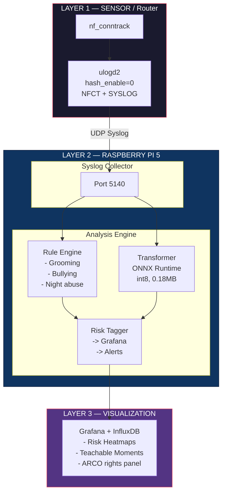
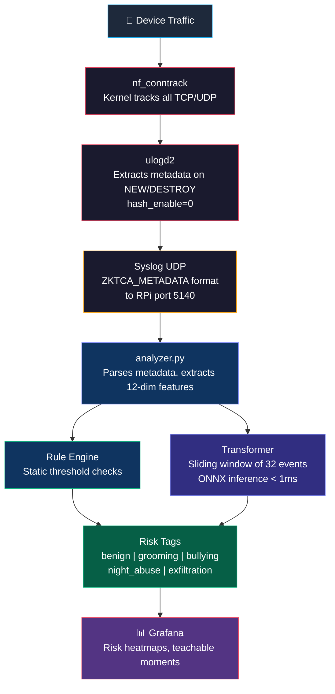
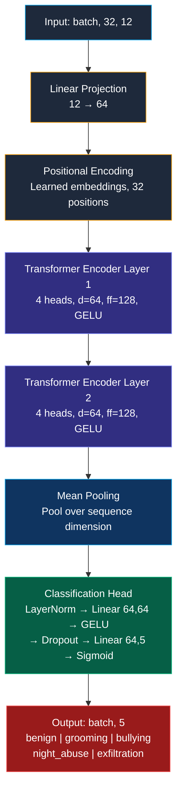

# 🏗️ Architecture & Setup Guide

Detailed architecture, data flow, deployment, and execution instructions for the ZKTCA Child Protection System.

---

## Table of Contents

1. [System Architecture](#system-architecture)
2. [Data Flow Pipeline](#data-flow-pipeline)
3. [Component Details](#component-details)
4. [How Transformers Work](#how-transformers-work)
5. [Transformer Model Architecture](#transformer-model-architecture)
6. [How to Run](#how-to-run)
7. [Deployment to Raspberry Pi](#deployment-to-raspberry-pi)
8. [Grafana Dashboard Setup](#grafana-dashboard-setup)
9. [Legal Compliance Module](#legal-compliance-module)

---

## System Architecture

The system follows a **Sensor → Collector → Analyzer → Dashboard** pipeline with strict separation of concerns:



### Hardware Requirements

| Component | Specification | Purpose |
|---|---|---|
| Router | MediaTek MT7986A, 1GB RAM, OpenWrt 23.05+ | Network metadata extraction |
| Raspberry Pi | RPi 5, 8GB RAM, NVMe SSD 256GB | ML inference + data storage |
| Network | Gigabit Ethernet with VLAN support | Isolate children's traffic |

---

## Data Flow Pipeline



### Metadata Format (ZKTCA)

Each log line from the router follows this format:

```
ZKTCA_METADATA: src_ip=192.168.1.10 dst_ip=8.8.8.8 src_port=12345 dst_port=443 protocol=6 packets=15 bytes=25000 event=NEW
```

**What is captured** (metadata only):
- Source and destination IP addresses
- Source and destination ports
- Protocol number (6=TCP, 17=UDP)
- Packet count and byte count
- Connection event type (NEW / DESTROY)

**What is NOT captured** (privacy by design):
- ❌ No packet content / payload
- ❌ No URLs or domain names
- ❌ No SNI (Server Name Indication)
- ❌ No DNS queries
- ❌ No TLS decryption

---

## Component Details

### 1. Router Sensor (`ulogd.conf`)

The router runs OpenWrt with `ulogd2` configured to export connection tracking events:

```ini
[ct1]
hash_enable=0    # Critical: emit NEW and DESTROY separately

[syslog1]
facility=16      # local0
level=6          # informational
format="ZKTCA_METADATA: src_ip=%(src_ip)s dst_ip=%(dst_ip)s ..."
```

**Key setting:** `hash_enable=0` ensures each connection lifecycle (start → end) is logged as two separate events, allowing the analyzer to compute exact connection durations and Inter-Arrival Times (IAT).

### 2. Analysis Engine (`analyzer.py`)

The analyzer supports three operating modes:

| Mode | Flag | Description |
|---|---|---|
| **Rules** | `--mode rules` | Static thresholds only (lightweight, no ML) |
| **Transformer** | `--mode transformer` | ML-only classification via ONNX |
| **Hybrid** | `--mode hybrid` | Both engines in parallel (default) |

### 3. Grafana Dashboard (`grafana_dashboard.json`)

Privacy-preserving panels:
- **Risk Heatmap** — Geographic map of connections highlighting risky jurisdictions
- **Teachable Moments** — Alert table for parent-child dialogue opportunities
- **Night Activity** — Stat panel showing off-hours connection minutes

---

## How Transformers Work

### The Core Idea

A **Transformer** is a neural network architecture introduced in the paper *"Attention Is All You Need"* (Vaswani et al., 2017). It was originally designed for translating text between languages, but its core mechanism — **self-attention** — turns out to be remarkably effective for *any* sequential data, including network traffic flows.

The fundamental question our model answers: **"Given the last 32 network events from this device, does the sequence represent a behavioral risk?"**

### Self-Attention: The Key Mechanism

Imagine a security analyst reviewing a log of 32 network events. They wouldn't look at each event in isolation — they'd compare events against each other:

- *"The child was playing Minecraft at 4:00 PM (event #12) and suddenly connected to Telegram at 4:03 PM (event #18) — that's suspicious."*
- *"But connecting to YouTube at 8 PM (event #25) after Netflix at 7:30 PM (event #20) — that's normal."*

Self-attention does exactly this, but mathematically. For each event in the sequence, the model computes an **attention score** against every other event:

```
Event #18 (Telegram at 4:03 PM) pays attention to:
  Event #12 (Minecraft at 4:00 PM)  →  Attention = 0.85  ← HIGH (port category shift!)
  Event #15 (YouTube at 3:55 PM)    →  Attention = 0.10  ← LOW (irrelevant)
  Event #5  (School at 9:00 AM)     →  Attention = 0.02  ← LOW (too far back)
```

The math behind this uses three learned projections — **Query (Q), Key (K), Value (V)**:

```
Attention(Q, K, V) = softmax(Q × Kᵀ / √d) × V

Where:
  Q = "What am I looking for?" (each event asks a question)
  K = "What do I contain?"    (each event advertises its content)
  V = "What do I contribute?" (the actual information to aggregate)
  d = 64 (dimension, for numerical stability)
```

### Multi-Head Attention

Our model uses **4 attention heads** running in parallel. Each head learns to focus on a different aspect:

| Head | What it might learn |
|---|---|
| Head 1 | Port category transitions (gaming → chat) |
| Head 2 | Temporal patterns (IAT, time of day) |
| Head 3 | Volume anomalies (bytes, packet counts) |
| Head 4 | Destination diversity (entropy, new IPs) |

This is like having 4 analysts reviewing the same log, each with a different expertise.

### Why NOT Use RNNs/LSTMs?

Older sequence models (RNNs, LSTMs) process events one-by-one, left to right. They struggle with:

| Problem | RNN/LSTM | Transformer |
|---|---|---|
| Long-range dependencies | Forgets early events by event #32 | Every event sees every other event directly |
| Training speed | Sequential (slow) | Fully parallel (fast) |
| Variable importance | Fixed decay over distance | Learned attention weights |

For child protection, this matters: a grooming pattern might start at event #5 (gaming) and complete at event #28 (chat). An LSTM might forget event #5 by then; a Transformer won't.

### From Language to Network Flows

| NLP Concept | Our Equivalent |
|---|---|
| Word | One network flow event |
| Sentence | Window of 32 consecutive events |
| Vocabulary | 12-dimensional feature vector per event |
| Sentiment analysis | Multi-label risk classification |
| Token embedding | Linear projection (12 → 64 dimensions) |
| Position in sentence | Learned positional encoding (32 positions) |

### Why It's Safe for Edge Deployment

| Constraint | Solution |
|---|---|
| Raspberry Pi has no GPU | int8 quantization → <1ms on CPU |
| Must fit in memory | 0.18 MB model (smaller than a JPEG) |
| Must not require internet | Fully offline inference via ONNX Runtime |
| Must not need PyTorch | Only numpy + onnxruntime on the Pi |

## Transformer Model Architecture



### Feature Vector (12 dimensions per flow event)

| # | Feature | Type | Description |
|---|---|---|---|
| 0 | `dst_port_cat` | Categorical | 0=other, 1=gaming, 2=chat, 3=cloud |
| 1 | `protocol` | Binary | 0=TCP, 1=UDP |
| 2 | `packets_log` | Numerical | log1p(packet count) |
| 3 | `bytes_log` | Numerical | log1p(byte count) |
| 4 | `duration` | Numerical | Connection duration in seconds |
| 5 | `bytes_ratio` | Numerical | Upload/download ratio |
| 6 | `iat` | Numerical | Inter-Arrival Time since last event |
| 7 | `hour_sin` | Numerical | sin(2π × hour/24) — cyclic encoding |
| 8 | `hour_cos` | Numerical | cos(2π × hour/24) — cyclic encoding |
| 9 | `unique_dst_5m` | Numerical | Unique dest IPs in 5-min window |
| 10 | `dst_entropy` | Numerical | Shannon entropy of destinations |
| 11 | `is_new_dst` | Binary | 1 if destination not in baseline |

### Platform Auto-Detection

The training script auto-detects the host OS and selects the best accelerator:

| OS | Accelerator | Backend |
|---|---|---|
| macOS (Apple Silicon) | Metal GPU | `torch.device("mps")` |
| Linux (NVIDIA GPU) | CUDA | `torch.device("cuda")` |
| Windows (NVIDIA GPU) | CUDA | `torch.device("cuda")` |
| Any (no GPU) | CPU | `torch.device("cpu")` |

Run `python3 model/platform_utils.py` to check your system:

```
=======================================================
  ZKTCA Platform Report
=======================================================
  OS:           macOS (Darwin)
  Architecture: arm64
  CUDA:         ❌ Not available
  MPS (Metal):  ✅ Available
  Device:       MPS
=======================================================
```

---

## How to Run

### Prerequisites

- Python 3.9+
- pip

### Step 1: Install Dependencies

```bash
cd theat_not_found
pip install -r requirements.txt
```

### Step 2: Generate Training Data

```bash
python3 model/generate_training_data.py
```

This creates **62,400 synthetic flow sequences** across 5 risk categories, including:
- Hard negatives (benign gaming, brief night usage)
- Multi-label combinations (grooming+night, night+exfiltration)
- Variant patterns (gradual grooming, mild bullying)
- Noise-augmented copies for robustness

### Step 3: Train the Model

```bash
python3 model/train.py
```

The script will:
1. Print a platform report (OS, GPU availability)
2. Auto-select the best accelerator (MPS / CUDA / CPU)
3. Train for up to 50 epochs with early stopping
4. Save the best checkpoint to `model/models/best_model.pt`

### Step 4: Export to ONNX

```bash
python3 model/export_onnx.py
```

This exports the model to ONNX format and applies int8 quantization:
- `model/models/zktca_transformer.onnx` — Full precision (0.35 MB)
- `model/models/zktca_transformer_q8.onnx` — Quantized (0.18 MB)

### Step 5: Run the Analyzer

```bash
# Hybrid mode (rules + transformer, default)
python3 analyzer.py --mode hybrid

# Rules only
python3 analyzer.py --mode rules

# Transformer only
python3 analyzer.py --mode transformer
```

### Step 6: Test with Simulated Traffic

In a separate terminal:

```bash
# Quick smoke test (8 events)
python3 test_analyzer.py

# Full realistic 24-hour simulation (310 events, 4 children's devices)
python3 test_realistic.py --speed 0

# Single scenario for demos
python3 test_realistic.py --scenario grooming --speed 0.5
```

The realistic simulator sends traffic from 4 virtual children (Sofía, Diego, Valentina, Mateo) with embedded risk patterns, printing a report of expected vs. actual alerts.

---

## Deployment to Raspberry Pi

### Transfer the quantized model

```bash
scp model/models/zktca_transformer_q8.onnx pi@raspberrypi:/home/pi/zktca/model/models/
scp analyzer.py pi@raspberrypi:/home/pi/zktca/
scp requirements.txt pi@raspberrypi:/home/pi/zktca/
```

### Install on RPi (aarch64)

```bash
ssh pi@raspberrypi
cd /home/pi/zktca
pip install onnxruntime numpy
python3 analyzer.py --mode transformer --port 5140
```

> **Note:** PyTorch is NOT required on the Raspberry Pi. Only `onnxruntime` and `numpy` are needed for inference.

---

## Grafana Dashboard Setup

### 1. Install Grafana on the Raspberry Pi

```bash
sudo apt install grafana
sudo systemctl enable grafana-server
sudo systemctl start grafana-server
```

### 2. Add InfluxDB as Data Source

Configure InfluxDB (or any time-series DB) to receive risk tags from `analyzer.py`.

### 3. Import the Dashboard

1. Open Grafana at `http://raspberrypi:3000`
2. Go to **Dashboards → Import**
3. Upload `grafana_dashboard.json`
4. Select the InfluxDB data source

---

## Legal Compliance Module

The system includes a built-in compliance module aligned with Mexican privacy law (SFP 2026):

### Privacy Notice

Generated automatically at system startup:

```
=== AVISO DE PRIVACIDAD SIMPLIFICADO (Ley Federal SFP 2026) ===
El presente sistema de telemetría de red procesa únicamente METADATOS
(tamaño de paquetes, tiempos de conexión y direcciones IP) con el fin
exclusivo de garantizar el Interés Superior del Menor protegiéndolo de
riesgos digitales.
NO SE INSPECCIONA NI DESENCRIPTA EL CONTENIDO DE LA NAVEGACIÓN.
Los metadatos se retendrán por un máximo de 30 días.
===============================================================
```

### ARCO Rights (programmatic API)

```python
from analyzer import LegalComplianceModule

# Download anonymized profile
LegalComplianceModule.execute_arco_download("192.168.1.100")

# Delete all data for a user
LegalComplianceModule.execute_arco_deletion("192.168.1.100")
```

### Data Minimization

- Metadata logs are automatically purged after **30 days**
- No content is ever stored — only flow-level statistics
- Grafana displays risk scores, never raw IP addresses or browsing history
