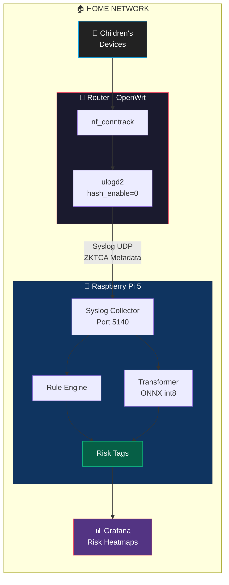
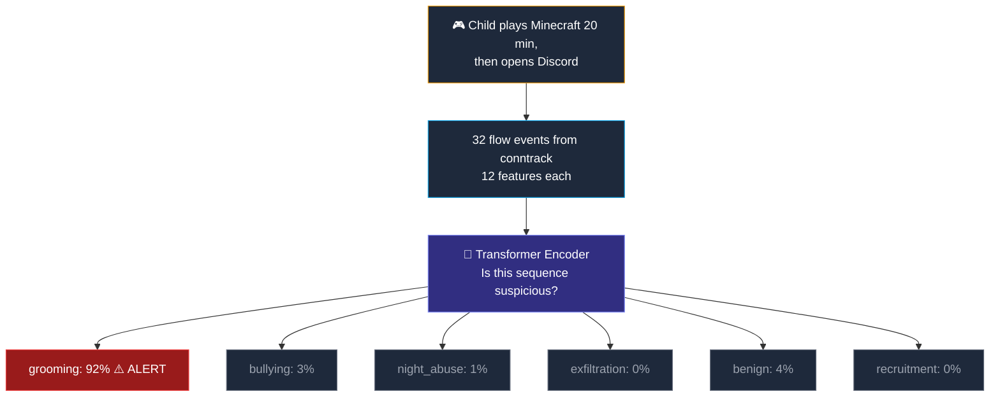

# 🛡️ Threat Not Found — ZKTCA Child Protection System

> **Zero-Knowledge Traffic Classification Analysis** for behavioral risk detection at the router level.

A privacy-first child protection MVP that detects grooming, cyberbullying, nocturnal abuse, data exfiltration, and **criminal recruitment** using **only network metadata** — no content inspection, no DPI, no decryption.

---

## 🧩 Architecture



### Key Design Principles

| Principle | Implementation |
|---|---|
| **Zero-Knowledge** | Only flow metadata (IPs, ports, bytes, timestamps). No payload inspection. |
| **TLS 1.3 / ECH compatible** | Works with fully encrypted traffic — no need to break encryption. |
| **Privacy-first** | Grafana shows risk heatmaps, never browsing history. Logs auto-purge after 30 days. |
| **Mexican Law (SFP 2026)** | Built-in ARCO rights module, privacy notices, and *Interés Superior del Menor*. |
| **Edge AI** | Transformer model runs on Raspberry Pi 5 via ONNX Runtime (0.18 MB, <1ms inference). |

---

## 📁 Project Structure

```
theat_not_found/
├── README.md                        # This file
├── ARCHITECTURE.md                  # Detailed architecture & how-to-run guide
├── requirements.txt                 # Python dependencies
├── ulogd.conf                       # Router sensor configuration (OpenWrt)
├── analyzer.py                      # Main analysis engine (rules + transformer)
├── test_analyzer.py                 # Basic traffic tests (8 events)
├── test_realistic.py                # Realistic 24h simulator (400+ events, 5 devices)
├── grafana_dashboard.json           # Grafana dashboard model (risk heatmaps)
└── model/
    ├── platform_utils.py            # OS detection (macOS/Linux/Windows)
    ├── generate_training_data.py    # Enhanced dataset generator (79K+ samples, 6 classes)
    ├── transformer_model.py         # Transformer architecture (PyTorch)
    ├── train.py                     # Training script (MPS / CUDA / CPU)
    ├── export_onnx.py               # ONNX export + int8 quantization
    ├── data/                        # Generated training data (.npy)
    └── models/                      # Trained models (.pt, .onnx)
```

---

## 🚀 Quick Start

```bash
# 1. Install dependencies
pip install -r requirements.txt

# 2. Generate synthetic training data (79,200 samples)
python3 model/generate_training_data.py

# 3. Train the transformer (auto-detects GPU)
python3 model/train.py

# 4. Export to ONNX + quantize for Raspberry Pi
python3 model/export_onnx.py

# 5. Run the analyzer in hybrid mode
python3 analyzer.py --mode hybrid

# 6. (In another terminal) Run the realistic 24h simulation
python3 test_realistic.py --speed 0
```

See [ARCHITECTURE.md](ARCHITECTURE.md) for detailed setup, configuration, and deployment instructions.

---

## 🔍 Risk Detection

| Risk | What the model detects | How |
|---|---|---|
| **Grooming** | Gaming → encrypted chat transition | Port category shift within <5 min window |
| **Bullying** | Burst of traffic from many sources | >10 unique IPs, asymmetric download-heavy |
| **Night Abuse** | Persistent activity 11PM–4AM | Human-like IAT patterns in restricted hours |
| **Exfiltration** | Large uploads to cloud storage | >50MB upload ratio to unauthorized servers |
| **Recruitment** | Social media → encrypted group + large inbound media | Platform migration + download-heavy group traffic |

---

## ⚖️ Legal Compliance (Mexico 2026)

- **Aviso de Privacidad** — Auto-generated at system startup
- **Derechos ARCO** — Download/delete profile data via API
- **Data Minimization** — Metadata auto-purge after 30 days
- **Interés Superior del Menor** — Manual override for all blocking rules
- **SFP / Secretaría de Anticorrupción** — Aligned with post-INAI regulatory framework

---

## 🧠 Transformer Model

### Why Transformers?

Traditional rule-based systems rely on static thresholds (e.g., "if port changes from gaming to chat within 5 minutes"). They work for known patterns but fail with:
- **Subtle variations** — a gradual transition instead of an abrupt switch
- **Multi-label scenarios** — grooming happening at night simultaneously
- **Adaptive adversaries** — predators who change behavior over time

Transformers solve this by learning **temporal relationships** across sequences of events. Originally designed for language ("Attention Is All You Need", Vaswani et al. 2017), they are equally powerful for network flow sequences because:

1. **Self-Attention** — Each flow event "looks at" every other event in the window, finding correlations like "gaming packet 5 minutes ago → encrypted chat now"
2. **Positional Encoding** — The model knows the order of events, detecting that a gaming→chat transition is suspicious but chat→gaming is normal
3. **Multi-head Attention** — 4 parallel attention heads specialize in different patterns (one might focus on port transitions, another on timing)
4. **Sequence Classification** — After encoding the full context, a classification head outputs probabilities for all 6 risk categories simultaneously

### How Our Model Works



The key insight: the model doesn't look at **individual packets** — it analyzes the **behavioral pattern** across a window of 32 consecutive events, just as a human analyst would.

### Model Specs

| Spec | Value |
|---|---|
| Architecture | 2-layer Encoder, 4 heads, d=64 |
| Parameters | 74,437 |
| Size (quantized) | 0.18 MB (int8) |
| Inference | <1ms (Mac), ~5ms (RPi 5 est.) |
| Validation F1 | 1.000 |
| Training data | 79,200 samples (multi-label, hard negatives, augmented) |
| Training | Auto-detects: MPS (Mac), CUDA (Linux/Win), CPU |

### Training Data

The model is trained on **79,200 synthetic flow sequences** designed to cover:

| Category | Samples | Description |
|---|---|---|
| Benign (normal) | 8,000 | School, YouTube, Netflix — standard browsing |
| Benign (gaming) | 2,000 | Pure gaming sessions (hard negative — should NOT trigger grooming) |
| Benign (brief night) | 2,000 | Quick late-night check (hard negative — should NOT trigger night abuse) |
| Benign (group chat) | 2,000 | School project group chat (hard negative — should NOT trigger recruitment) |
| Grooming (abrupt) | 8,000 | Sudden gaming → chat switch |
| Grooming (gradual) | 2,000 | Interleaved gaming + chat transition |
| Bullying (severe) | 8,000 | 15+ source IPs flooding a device |
| Bullying (mild) | 2,000 | 5-10 source IPs, lower volume |
| Night abuse | 8,000 | Persistent 11PM-4AM activity with human IAT |
| Exfiltration | 8,000 | >50MB uploads to cloud storage |
| Recruitment (rapid) | 8,000 | Social media → encrypted group + large inbound propaganda |
| Recruitment (gradual) | 2,000 | Gradual engagement with increasing download sizes |
| Grooming + Night | 2,000 | Multi-label: gaming→chat at 1AM |
| Night + Exfiltration | 2,000 | Multi-label: uploads at 2AM |
| Recruitment + Night | 2,000 | Multi-label: group recruitment at night |
| Noise-augmented | 13,200 | Gaussian noise copies for robustness |

---

## 🧪 Testing

### Basic Test
```bash
python3 test_analyzer.py  # 8 events, quick smoke test
```

### Realistic 24-Hour Simulation
```bash
python3 test_realistic.py --speed 0       # Fast (400+ events)
python3 test_realistic.py --speed 0.5     # Slow demo
python3 test_realistic.py --scenario grooming    # Single scenario
python3 test_realistic.py --scenario recruitment # Recruitment only
```

Simulates 5 children's devices over a full day:
- **Sofía** (12) — Normal usage (control, zero alerts expected)
- **Diego** (14) — Grooming: Minecraft → Discord at 4:28 PM
- **Valentina** (10) — Bullying: 15 IPs flooding at 2:15 PM
- **Mateo** (16) — Night abuse (1AM) + exfiltration (2:10 AM)
- **Carlos** (15) — Criminal recruitment: TikTok → Telegram group + propaganda downloads at 5:30 PM

---

## 🤖 AI Disclaimer

This project was developed with the assistance of AI-powered coding tools:

| Tool | Provider | Role |
|---|---|---|
| **Antigravity** | Google DeepMind | Agentic coding assistant — architecture design, code generation, testing, and documentation |
| **Gemini 3.1 Pro** | Google | Large language model powering Antigravity's reasoning and code synthesis |
| **Claude Opus 4.6** | Anthropic | Supplementary AI assistance for research, analysis, and code review |

All AI-generated code was reviewed, tested, and validated by the development team. The architectural decisions, security design (ZKTCA paradigm), and legal compliance framework (SFP 2026) were directed by the human team with AI serving as an accelerator.

> **Note:** The use of AI tools does not diminish the intellectual contribution of the team. AI was used as a pair-programming partner, not as a replacement for human judgment on privacy, ethics, and child safety design decisions.

---

## 📄 License

See [LICENSE](LICENSE) file.
